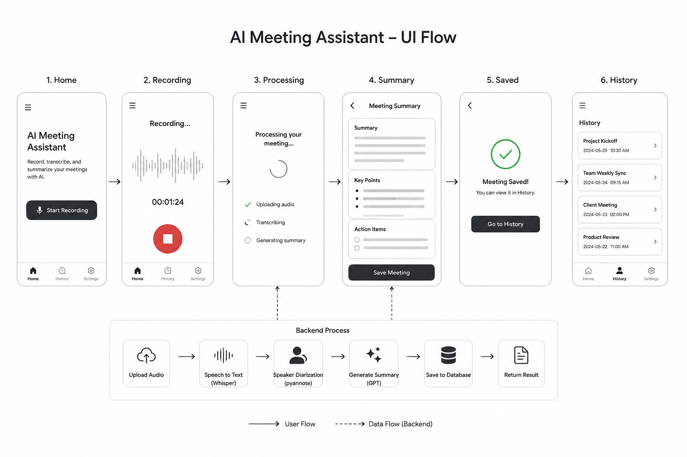

# 🎙️ AI Meeting Assistant

An AI-powered meeting assistant for **audio recording, speech-to-text transcription, speaker diarization, and intelligent meeting summarization**.

Built with a **full-stack architecture** using **React, FastAPI, PostgreSQL, OpenAI, and AssemblyAI**, and deployed on **Vercel** and **Render**.

The application allows users to **record or upload meeting audio**, automatically generate **timestamped transcripts**, identify **multiple speakers**, and produce **AI-generated meeting summaries and key insights**.

---

## 🚀 Live Demo

Try the live demo here:

🔗 https://ai-meeting-assistant-alpha.vercel.app/


> Demo supports meeting recording, `.m4a` upload, transcription, AI summarization, and meeting history.

---

## 📱 Demo Preview

### UI Flow




### Core Features

- 🎤 **Voice Recording**
  - Record meetings directly in browser
  - Real-time audio waveform animation
  - Cancel recording without uploading

- 📂 **Audio Upload**
  - Support `.m4a` meeting files
  - Upload and transcribe existing recordings

- 📝 **AI Transcription(AssemblyAI)**
  - Speech-to-text transcription
  - Timeline transcript with timestamps
  - Speaker diarization
  - Multi-speaker conversation parsing

- 🧠 **AI Meeting Summary(OpenAI)**
  - Meeting summary
  - Key information extraction
  - Action items
  - Content classification
  - Context-aware meeting understanding

- 📚 **Meeting History**
  - Persistent PostgreSQL storage
  - Meeting history retrieval
  - Click transcript to jump audio timestamp

- ✨ **Mobile-first UI**
  - Smooth page transition animations
  - Responsive design
  - Recording state protection

---

## 🏗️ System Architecture

```text
Frontend (React + Vite)
        ↓
Backend API (FastAPI)
        ↓
AssemblyAI
(Speech-to-Text + Speaker Diarization)
        ↓
OpenAI GPT
(Meeting Summary + Action Items + Analysis)
        ↓
PostgreSQL Database
        ↓
Meeting History Retrieval
```

---

## 🧩 Tech Stack

### Frontend
- React
- Vite
- JavaScript
- Web Audio API
- MediaRecorder API
- CSS Animation

### Backend
- FastAPI
- Python
- SQLAlchemy
- PostgreSQL

### AI / SDKs
- OpenAI API (Meeting summarization & analysis)
- AssemblyAI API (Speech-to-text & speaker diarization)
- Prompt Engineering
- LLM Workflow Design

### Deployment
- Vercel (Frontend)
- Render (Backend + PostgreSQL)

---

## ⚙️ Features in Development

- [ ] Real-time streaming transcription
- [ ] Multi-agent meeting analysis pipeline
- [ ] Speaker identification
- [ ] Export to PDF / Markdown
- [ ] Meeting search & tagging
- [ ] Authentication system

---

## 📂 Project Structure

```text
AI-Meeting-Assistant
│
├── backend/              # FastAPI backend
├── database/             # Database schema
├── prompts/              # LLM prompts
├── web-frontend/         # React frontend
├── docs/
│   ├── image/
│   └── UI_FLOW.md
│
└── README.md
```

---

## 🧠 Why I Built This

I built this project to explore how **AI agents and LLMs can improve meeting productivity** through transcription, summarization, and structured action extraction.

This project also serves as a **full-stack AI application portfolio project**, combining:

- Frontend engineering
- Backend API development
- Database persistence
- AI workflow orchestration
- Product & UX thinking

---

## 👨‍💻 Author

**Li-Xing Chen**  
M.S. Student @ National Taiwan University  
AI / Software Engineering / Product-focused projects

LinkedIn: *(https://www.linkedin.com/in/li-xing-chen-89b662280/)*

GitHub: https://github.com/leo9003
