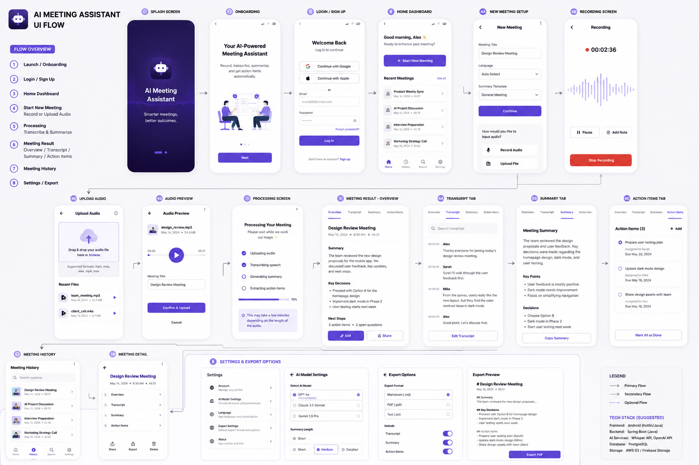

# UI Flow

## Full UI Design



## Overview

AI Meeting Assistant is a mobile-first AI meeting application that helps users record, upload, transcribe, summarize, and manage meeting content automatically.

This document defines the end-to-end user flow of the application.

---

## Full User Flow

```text
Launch App
    ↓
Splash Screen
    ↓
Onboarding
    ↓
Login / Sign Up
    ↓
Home Dashboard
    ↓
Start New Meeting
 ┌───────────────┐
 ↓               ↓
Record Audio   Upload Audio
 ↓               ↓
Recording      Audio Preview
 └───────↓───────┘
        Processing
              ↓
       Meeting Result
    ┌─────┬─────┬─────┐
    ↓     ↓     ↓     ↓
Overview Transcript Summary Action Items
              ↓
        Save to History
              ↓
        Meeting History
              ↓
     Meeting Details
              ↓
     Settings / Export
```

---

## Screens

### 1. Splash Screen

Purpose:
- Display app branding
- Initialize system resources

---

### 2. Onboarding

Purpose:
- Explain core product value

Features:
- AI meeting transcription
- AI summary generation
- Action item extraction

---

### 3. Login / Sign Up

Authentication methods:
- Google Login
- Apple Login
- Email / Password

---

### 4. Home Dashboard

Functions:
- View recent meetings
- Start new meeting
- Search history
- Navigate to settings

---

### 5. New Meeting Setup

User inputs:

- Meeting title
- Language selection
- Summary template

Options:

- Record Audio
- Upload Audio File

---

### 6. Recording Screen

Functions:

- Live recording timer
- Audio waveform
- Pause recording
- Add note
- Stop recording

---

### 7. Upload Audio

Supported formats:

- MP3
- M4A
- WAV

Flow:

Upload → Audio Preview → Confirm Upload

---

### 8. Processing Screen

Backend workflow:

1. Upload audio
2. Speech-to-text transcription
3. Summary generation
4. Action item extraction

Status tracking:
- Uploading
- Transcribing
- Summarizing
- Extracting action items

---

### 9. Meeting Result

#### Overview
- Meeting title
- Key summary
- Key decisions
- Next steps

#### Transcript
- Full meeting transcript

#### Summary
- AI-generated summary

#### Action Items
- Auto-generated tasks
- Task owner
- Due date

---

### 10. Meeting History

Functions:
- Search meetings
- Open previous meetings
- Delete meeting
- Re-open summary

---

### 11. Settings / Export

Settings:
- AI Model selection
- Language
- Summary length

Export:
- PDF
- Markdown
- Text
